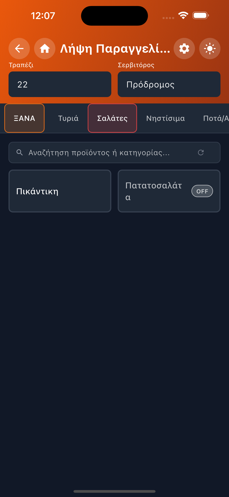
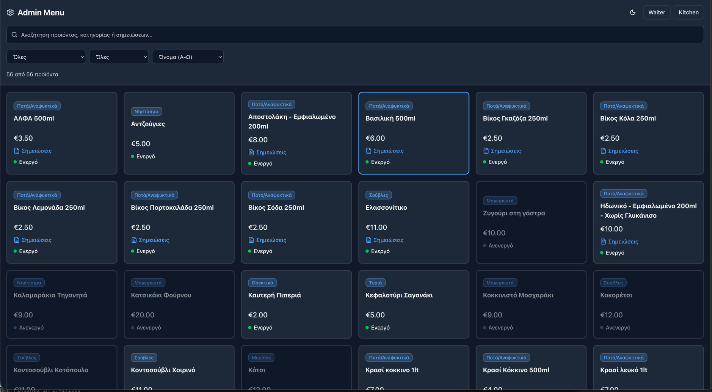
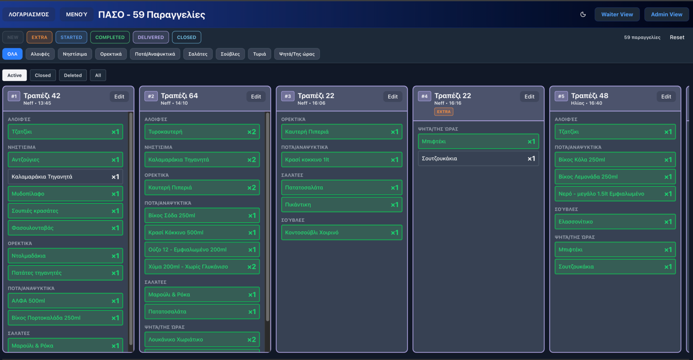

# Taverna Prodromes — Digital Ordering System

Pilot Presentation

Owner: Prodromos Sarakinou  
Challenge: 100 Days of Code  
System: NextJS + Flutter Waiter App

---

## 1 — Problem

Traditional tavern service has:

- Paper orders
- Communication errors
- Lost extras
- Slow kitchen coordination
- No real-time visibility

Goal:  
Create a lightweight digital ordering system usable during real service.

---

## 2 — Architecture

Frontend  
Flutter Waiter App (PDA)

Backend  
NextJS API

Database  
PostgreSQL

Deployment  
Heroku

Capabilities

- Real-time orders
- Kitchen display
- Extras management
- Billing system
- Menu management

---

## 3 — Waiter App (PDA)

Pilot context: Clean Monday, high traffic, real restaurant conditions. PDA used by staff throughout service for fast order intake, updates, and completion.

  <figure style="flex:0 0 calc(33% - 14px); margin:0;">
    
  </figure>
  <figure style="flex:0 0 calc(33% - 14px); margin:0;">
    
  </figure>
  <figure style="flex:0 0 calc(33% - 14px); margin:0;">
    
  </figure>
  <figure style="flex:0 0 calc(33% - 14px); margin:0;">
    
  </figure>
  <figure style="flex:0 0 calc(33% - 14px); margin:0;">
    
  </figure>
  <figure style="flex:0 0 calc(33% - 14px); margin:0;">
    
  </figure>

Pilot outcome: reduced communication errors, extras correctly linked to base orders, high entry speed during peak, no device freezes. Total 940 items processed with smooth flow from intake to billing.

---

## 4 — Order Intake

During the pilot, order flow stayed fast: quick category switch, real‑time build, confirmation without interruptions. Corrections used soft delete without blocking service; waiters switched tables quickly.

---

## 5 — Extras Flow

In the pilot, extras were issued as separate kitchen tickets linked to the base order. This kept the kitchen clear on what to prepare, reduced back‑and‑forth, and ensured accurate billing.

---

## 6 — Kitchen Display

Capabilities

- Live orders
- Sorting by time
- Order editing
- Soft delete
- Status tracking

Used in the pilot under heavy load. Priorities, edits, and soft deletes worked without blocking dish progression.

Web screenshots (scaled proportionally):

  

  

  

---

## 7 — Billing System

Features

- Bill aggregation
- Extras included automatically
- Print-ready PDF
- Order auto-close after billing

---

## 8 — Admin Panel

Allows

- Menu editing
- Activation / deactivation
- Category management
- Notes

---

## 9 — Real World Pilot

Event  
Clean Monday  
Traditional Koudounoforoi Festival

Environment  
High volume service  
Real restaurant operation  
No staging testing beforehand

Outcome  
System remained stable throughout the service.

---

## 10 — Pilot Statistics

Menu

- 56 total items
- 37 active

Orders

- 142 total processed

Bills

- 89 created

Top item (private)

- Βίκος Κόλα 250ml

Total items processed

- 940

---

## 11 — Operational Observations

What worked well

- Fast order entry
- Clear extras workflow
- Kitchen visibility
- PDA usability
- Corrections handled via soft delete without blocking service.

---

## 12 — Key Fixes During Pilot

- Removed 10 order cap in kitchen
- Prevented cross-table bill merges
- Added completed orders to billing popup
- Soft delete instead of hard delete
- Kitchen editing popup
- Bill search and filters

---

## 13 — System Maturity

From idea → live service in days.  
Real restaurant test  
Hundreds of items processed  
Multiple staff users  
Stable PDA operation

---

## 14 — Next Steps

- UI polish
- Deployment improvements
- Analytics dashboard
- Performance optimizations
- Continued pilot testing
